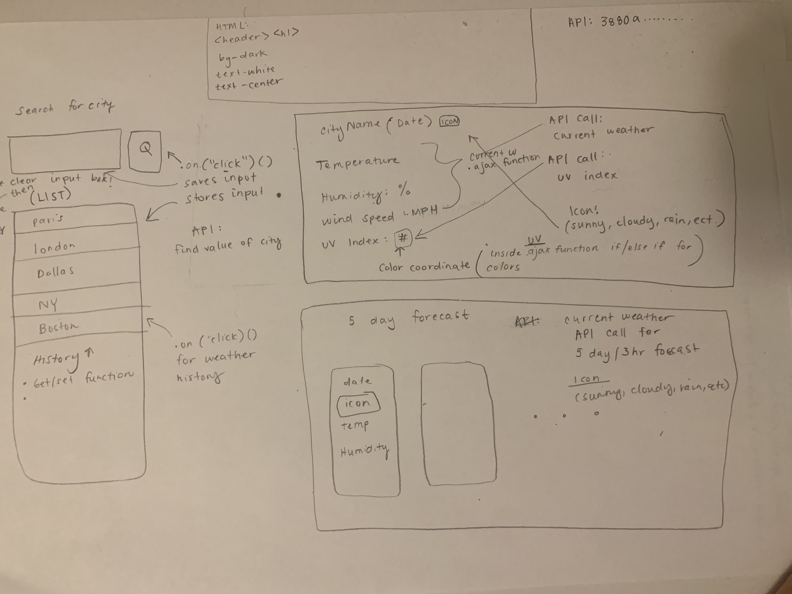
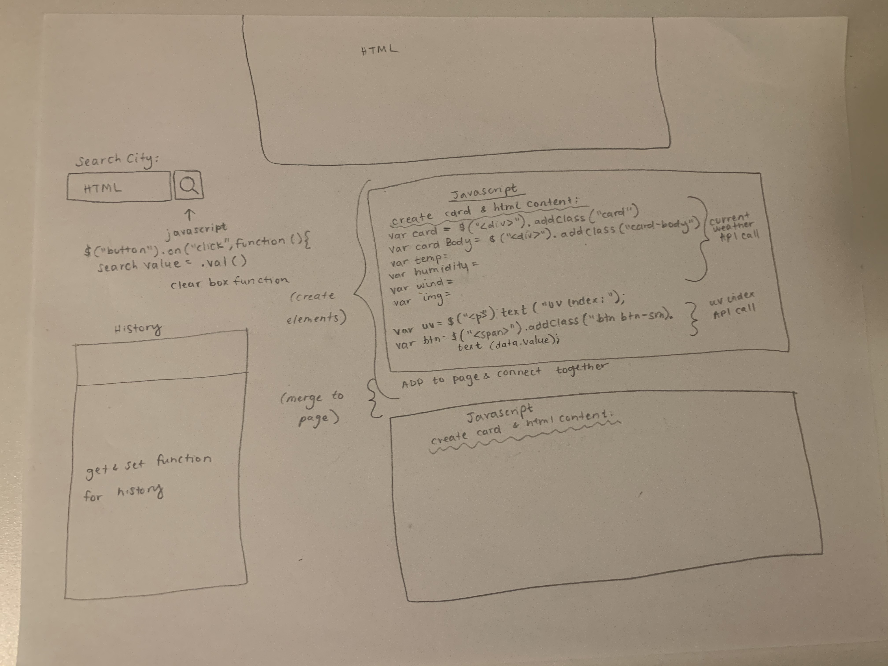

<br>
<u>

<center>

# Weather API 

</u>

<u>

## Goal: 

</u>
</center>

### Our goal for this assignment was to create a weather app using our API from Open Weather. By using APIs, we are able to get information from another source and utilize it into our own sites. This can help save us the time and effort of doing research and data collection all on our own, and makes life easier!

<br>


Through this assignment, I focused alot on understanding the code. Since the template was sent to us, I made sure to study it from top to bottom! My last couple of assignments I had alot of trouble with a few of the concepts, and being able to see it in a clear, formatted code was extremely helpful for me to understand what I did wrong in the past. Another thing that was really helpful for me in understanding all the steps to take for this assignment was to try a different kind of pseudo coding. Below, I show a picture of a more descriptive type of psuedo coding than the plain text and lists I had done previously. 

<br>


## Criteria:

Within this project, I included:

<center>

```
1. The use of APIs through Open Weather
2. Useage of cards through JQuery
3. History Log of the searches
4. Icons depending on the weather
5. UV color indicators 
6. Date, city, temperature, humidity, wind speed, uv index
 ```

</center>


<br>

<u>

## Issues with the project:

</u>

<br>

- There were alot of components to this project, and I was feeling myself getting confused. 

    -  I solved this issue by trying a new type of pseudo coding that was alot easier for me to understand. Below is my rough draft:

  <br>

    
    

   <br>
- Figuring out how to get the Password Generator Button to give output from the coding for the password generator.

    - To fix this, I realized all I needed was to add a simple 'float' to my image. This would make the text wrap around the image. Then, I added a margin to add space between my image and text. Below is an image of how it looked before and after I wrapped the text around the image (along with several other changes).
    


    <br>

<br>

## Technologies Used:

- Visual Studio Code
- Gitlab
- Terminal
- Github

<br>

## Table of Contents:
1. Goal
2. Module Description
3. Criteria
4. Issues
5. Technologies Used
6. Table of Contents
7. Links
8. Deployed Link

<br>

## Links:

- [Link to Github](https://github.com/kellystone4/weatherApp)
- [Link to LinkedIn](https://www.linkedin.com/in/kelly-a-stone/)

<br>

## Deployed Link:
- [Link to Weather App Site](https://kellystone4.github.io/weatherApp/)
